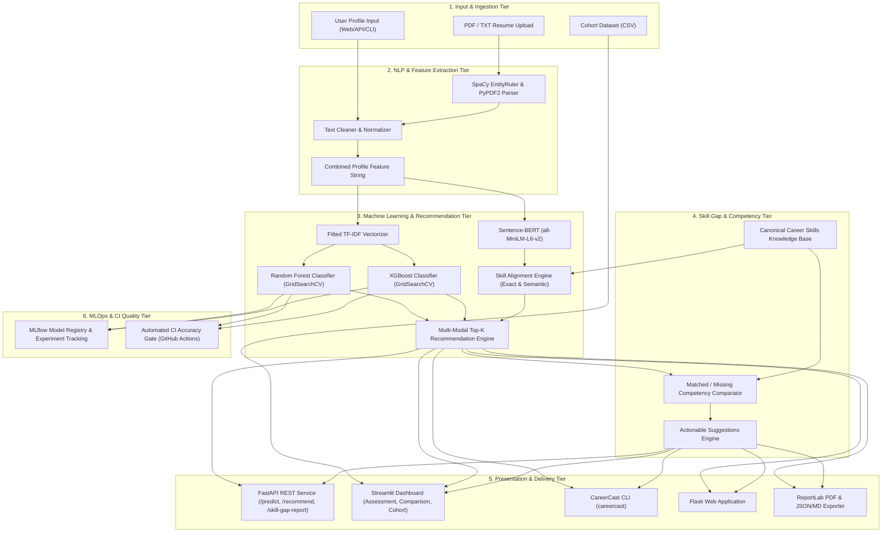

# System Architecture & Technical Design — CareerCast

CareerCast is designed as a modular, high-cohesion, multi-tiered AI architecture supporting resume parsing, multi-modal career classification, semantic skill alignment, cohort analytics, and REST/UI services.

---

## 1. High-Level Architecture Diagram

---

## 2. Component Breakdown

### Tier 1: NLP & Ingestion
- **`nlp/resume_parser.py`**: Extracts text from PDF files using `PyPDF2` and plain text files. Employs `spaCy` NER and `EntityRuler` to recognize custom domain entities across 40+ skills, 30+ degrees, 20+ roles, and 15+ certifications.
- **`nlp/preprocessing.py`**: Token cleaning, stopword filtering, and composite string serialization (`Education: ... | Skills: ... | Experience: ... | Certifications: ... | Projects: ...`).

### Tier 2: Machine Learning & Inference
- **`ml/random_forest.py`**: Tuned ensemble classifier using 5-Fold Stratified Cross-Validation over `n_estimators`, `max_depth`, `min_samples_split`, `criterion`.
- **`ml/xgboost_model.py`**: Gradient boosted decision tree classifier with GridSearchCV hyperparameter tuning over `learning_rate`, `n_estimators`, `max_depth`, `subsample`.
- **`ml/model_comparison.py`**: Dynamically evaluates trained models on test splits and selects the champion model.
- **`ml/skill_embeddings.py`**: Encodes technical skills into 384-dimensional dense semantic vectors using Sentence-BERT (`all-MiniLM-L6-v2`) and computes cosine similarities.
- **`ml/recommendation_engine.py`**: Blends multi-modal scoring:
  $$\text{Overall Score} = 0.50 \times \text{ML Prob} + 0.30 \times \text{Skill Alignment} + 0.20 \times \text{Semantic Sim}$$

### Tier 3: Skill Gap Analysis & Recommendations
- **`skill_gap/analyzer.py`**: Compares candidate skills against canonical career skill requirements, computes exact matched skills, missing skills, competency match %, and skill gap %.
- **`skill_gap/suggestions.py`**: Knowledge base containing curated, non-random learning actions, official documentation links, practical project prompts, priority levels, and estimated timeframes.

### Tier 4: Cohort Analytics & Multi-Career Comparison
- **`careercast/analytics/cohort.py`**: Aggregates batch candidate evaluations, calculates experience distributions, career distributions, skill frequencies, missing skill bottlenecks, and side-by-side comparative rankings.

### Tier 5: Presentation & Reports
- **`careercast/reports/generator.py`**: Generates structured JSON, Markdown, and multi-page vector PDF reports with running headers, footers, tables, and color badges.
- **`streamlit_app.py`**: Multi-tab interactive review dashboard with probability distribution bar charts, comparison cards, and cohort analytics.
- **`api/routes.py`**: High-throughput FastAPI REST API with Pydantic v2 schemas and Swagger documentation.
- **`careercast/cli/main.py`**: Cross-platform CLI entrypoint.

### Tier 6: MLOps & Quality Assurance
- **`ml/mlflow_integration.py`**: Logs experiment parameters, metrics (Accuracy, Precision, Recall, F1), models, vectorizers, and label encoders to SQLite backend and registers the best model in the MLflow Model Registry.
- **`ml/ci_accuracy_gate.py`**: Enforces automated CI accuracy gating on pull requests and commits.
